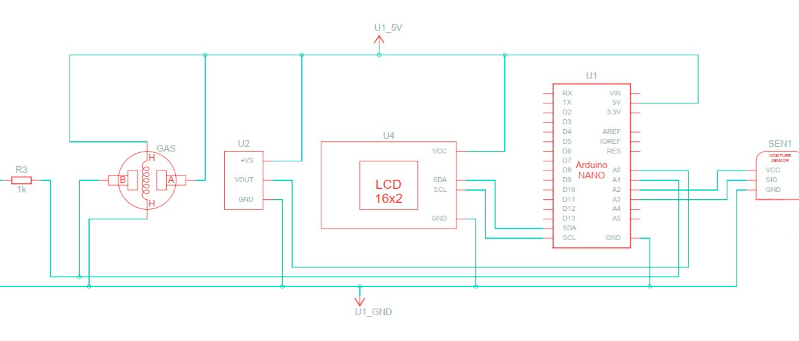

# 📟 Indoor Air-Quality Analyzer — ATmega328P

**Coursework design for an ATmega328P air-quality monitor (DHT11 + MQ-2 on a 16×2 LCD) — translated to English and brought to life with an Arduino sketch and unit-tested sensor math.**

A coursework project ("курсова робота") designing a microprocessor-based
indoor air quality monitor: an ATmega328P (Arduino Nano) reading a DHT11
temperature/humidity sensor and an MQ-2 gas sensor, with results shown on
a 16×2 I2C LCD and a USB/Li-Po dual power supply.

This repository is the English-language, GitHub-formatted version of a
Ukrainian-language coursework explanatory note completed at Y. O. Paton
Vocational College of Welding and Electronics, specialty 123 Computer
Engineering. The original is a design report with a schematic but no
actual firmware; this repo adds an Arduino sketch implementing the
report's described algorithm as example code, clearly marked as written
for the portfolio rather than part of the graded submission.

  
   <b>Circuit schematic</b> — ATmega328P (Arduino Nano) with DHT11, MQ-2 and an I²C 16×2 LCD, USB / Li-Po dual supply.

## Repository layout

| Path | Contents |
|---|---|
| [`docs/report.md`](docs/report.md) | Full English translation of the explanatory note: problem statement, survey of analogous devices, sensor/microcontroller theory, schematic walkthrough, user documentation, conclusion. Includes an "Editor's notes" section listing every correction, redaction, and omission made for this repo. |
| [`diagrams/schematic.png`](diagrams/schematic.png) | The original circuit schematic, with the title block (student/advisor names, group number) cropped out. |
| [`example-code/`](example-code/) | Not part of the original coursework. An Arduino sketch implementing the report's sensor-reading/calibration/alarm algorithm, plus a Python reference implementation (with unit tests) of the MQ-2 voltage-to-resistance math. |

## What's verified vs. what isn't

- `python3 -m unittest discover -s tests` in `example-code/` — **7/7 unit
  tests pass**, covering the MQ-2 voltage-to-resistance conversion, the
  Rs/R0 gas ratio, and the clean-air calibration average.
- `example-code/air_quality_monitor/air_quality_monitor.ino` has **not**
  been compiled, flashed, or run on real hardware — there's no lab or
  device behind this project, original or otherwise. Treat it as a worked
  example of how the report's described algorithm maps to Arduino C++, not
  as code that has been tested end-to-end.

## License

Licensed under [PolyForm Noncommercial 1.0.0](LICENSE) — free for personal,
educational, and other noncommercial use. For a commercial license,
contact Damir.
